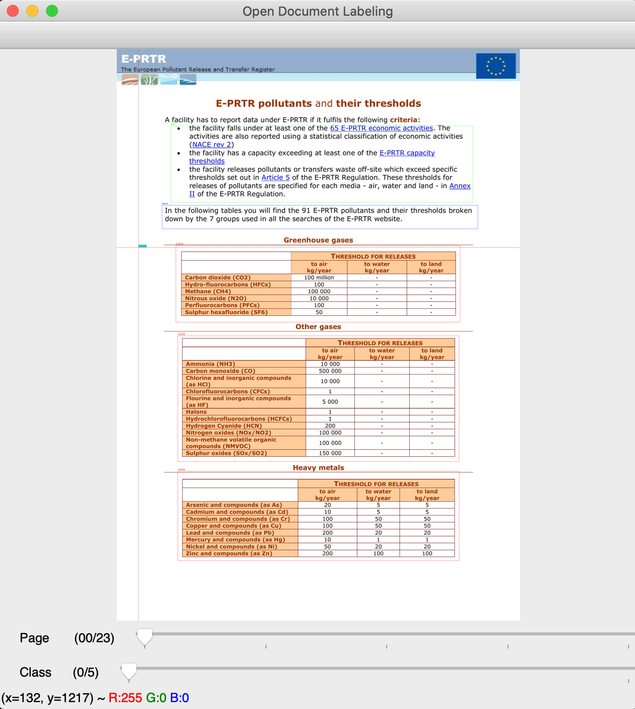
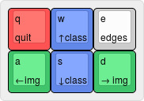

# Open Document Labeling

With Open Document Labeling, we provide a tool for the annotation of rectangular document regions for various document region detection and classification tasks.
The process of labeling regions is supported with a graphical user interface.

## Open Issues

* The original width and height of a document will be stored in the label output.
* We plan to support more annotations than just tables soon.
* The annotation type will be stored in the output csv.

## How-to

* Store input documents used forlabeling in ```data/custom/pdfs/```.
* Run ```main/main.py```.
* Label documents, as described in the next section.
* After closing the UI, the output labels will be stored as a CSV file in ```data/custom/``` as ```gt_labeled_datetime.csv```.

## Labeling Environment

A page of a document is shown in the main screen.
Users can draw rectangles over document regions in order to label them.
This is done by simply clicking on the according region for starting or ending the labeling process.



Pages as well as annotation classes can be switched using the following keyboard commands:



## Output Format

The output file containing the labeled regions is then stored as a CSV file ```data/custom/``` as ```gt_labeled_datetime.csv```.
The label coordinates are stored absolute.
However, we will provide the used width and height of pages in order to make it possible to transform the coordinates if needed.
The file contains the following columns:
* ```file```:  path to the labeled input file
* ```page```: annotated page referring to the file, starting with 0
* ```width```: absolute width of the page 
* ```height```: absolute height of the page 
* ```bounding_box```: list containing the annotated regions. Those are stored using 8 coordinates, referred to the 4 corner points: top left, bottom left, bottom right, top right.

## Project Structure

* ```data```: PDF data files and generated region ground-truth
* ```main```:
  * ```input```: converted PDF input files
  * ```output```: coordinate-based output of labeling
  * ```main.py```: labeling UI
  * ```remove_output.sh```: clean labels of input data
  * ```class_list.txt```: list of region classes which can then be used for labeling
* ```util```:
  * ```constants```: paths to input, output and ground-truth data, supported file types
  * ```StorageUtil```: store/load functionalities
  

## Acknowledgements

* The tool is based on the work of https://github.com/Cartucho/OpenLabeling and adapted for a labeling of PDF documents.
* Example PDFs are obtained from the ICDAR Table Recognition Challenge 2013 https://roundtrippdf.com/en/data-extraction/pdf-table-recognition-dataset/.
